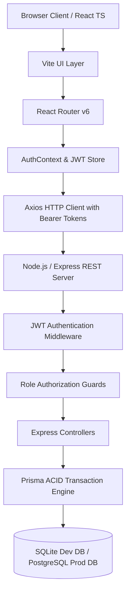

# System Architecture & Technical Design

## System Overview

The **Mini ERP + CRM Operations Portal** is a production-grade full-stack web application designed for wholesale and distribution enterprises. The architecture prioritizes data integrity, ACID transaction guarantees for stock operations, strict Role-Based Access Control (RBAC), and responsive UI design.

## Role-Based Access Control (RBAC)

The backend enforces authorization at the middleware layer. Frontend buttons reflect permissions, but API endpoints strictly reject unauthorized calls with HTTP 403 Forbidden.

| Feature / Action | Admin | Sales | Warehouse | Accounts |
| :--- | :---: | :---: | :---: | :---: |
| **View Dashboard & Reports** | ✅ | ✅ | ✅ | ✅ |
| **View Customers & Profiles** | ✅ | ✅ | ✅ | ✅ |
| **Add / Edit Customers** | ✅ | ✅ | ❌ | ❌ |
| **Delete / Deactivate Customer** | ✅ | ❌ | ❌ | ❌ |
| **Schedule / Complete Follow-ups** | ✅ | ✅ | ❌ | ❌ |
| **View Products & Stock Levels** | ✅ | ✅ | ✅ | ✅ |
| **Add / Edit Products** | ✅ | ❌ | ✅ | ❌ |
| **Manual Stock Adjustment (IN/OUT)** | ✅ | ❌ | ✅ | ❌ |
| **Create Sales Challan (Draft)** | ✅ | ✅ | ❌ | ❌ |
| **Confirm Sales Challan (Deduct Stock)** | ✅ | ✅ | ❌ | ❌ |
| **User Governance & Provisioning** | ✅ | ❌ | ❌ | ❌ |

## Inventory ACID Transaction Guarantees

When a sales challan is confirmed or a stock adjustment is submitted:
1. **Isolation & Atomicity**: The request executes inside a database transaction (`prisma.$transaction`).
2. **Stock Sufficiency Validation**: Real-time stock is evaluated. If `currentStock < requestedQty`, the transaction immediately aborts and rolls back.
3. **HTTP 400 Error Message**: Returns detailed error: `"Insufficient stock for Product XYZ. Available: 4, Requested: 7."`
4. **Historical Price Snapshot**: The item details (name, SKU, unit price, quantity, line total) are written directly into `challan_items` to preserve historical accuracy even if catalog prices change later.
5. **Immutable Stock Movement Audit**: An `OUT` movement record is automatically created for each item, referencing the user and reason.
